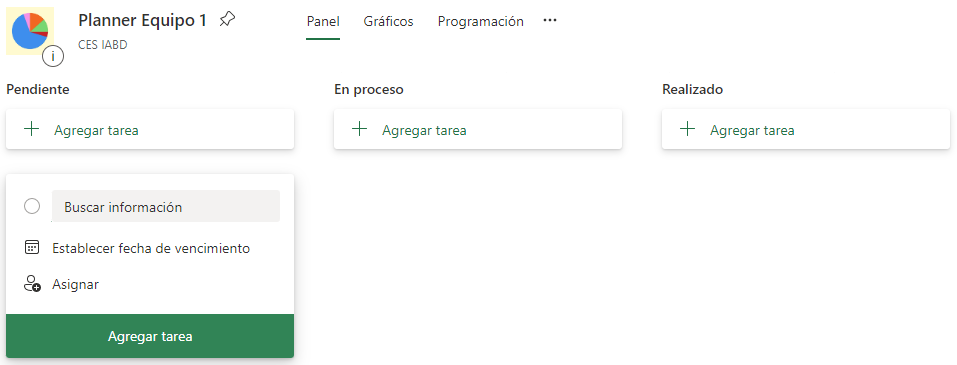

# Presentación PIA Lara

!!! important "Objetivo"
    Concretar una solución para el problema.

El PIA Lara nace como un Proyecto de Innovación Aplicada impulsado desde la *Conselleria d'Educació de la Comunitat Valenciana* para fomentar actuaciones de carácter innovador, experimental y formativo en FP, promoviendo la innovación en la práctica docente así como las relaciones entre los centros educativos de FP y las empresas.

Este proyecto se desarrolla de manera conjunta por:

* [IES Severo Ochoa](https://portal.edu.gva.es/03013224/es/inicio/) de Elche, con la participación del alumnado del curso de especialización en Inteligencia Artificial y Big Data.
* [IES Gran Vía](https://portal.edu.gva.es/iesgranvia/) de Alicante, con la participación del alumnado del ciclo superior de *Mediación Comunicativa*.
* [IES Victoria Kent](https://portal.edu.gva.es/ivk/es/inicio/) de Elche, con la participación del alumnado del ciclo superior de *Mediación Comunicativa* y el de *Integración Social*.
* [Tilúa](https://tilua.es/), como empresa experta en domótica asistencial.
* [José Barragán](http://josebarragancsd.com/), abogado especialista en derecho informático y ciberseguridad.
* [FacePhi](https://facephi.com/), empresa tecnológica experta en el uso de la IA, en especial la biometría.

Nuestro proyecto tiene como finalidad **mejorar la autonomía comunicativa de las personas con trastornos del habla o del lenguaje a través soluciones tecnológicas**.

Este proyecto no podemos abordarlo desde una visión reduccionista, atendiendo solo a las características tecnológicas de un producto, ya que como indica Joan Pahisa en un artículo publicado en cermi semanal *"si los programadores apenas conocen la realidad de las personas con discapacidad, la Inteligencia Artificial resultante adolecerá de esa capacidad de aprendizaje, de manera que terminará excluyéndolos"*.

Debemos por tanto tener una visión más holística y **enfocar este reto desde una perspectiva ética, asistencial y tecnológica**. 

Este proyecto está alineado con el Plan estratégico de Formación Profesional por parte del Ministerio de Educación y Formación profesional, el cual va ligado con los [**O**bjetivos de **D**esarrollo **S**ostenible (ODS)](https://www.un.org/sustainabledevelopment/es/) de la agenda 2030 de la Unión Europea y pretende desarrollar un proyecto moderno de país, y por tanto conseguir algunos de los ODS como son:

3. Salud y bienestar - Garantizar una vida sana y promover el bienestar de todos a todas las edades.
4. Educación de calidad - Garantizar una educación inclusiva, equitativa y de calidad y promover oportunidades de aprendizaje durante toda la vida para todos.
5. Igualdad de género - Lograr la igualdad entre los géneros y empoderar a todas las mujeres y las niñas.
8. Trabajo decente y crecimiento económico - Promover el crecimiento económico inclusivo y sostenible, el empleo y el trabajo decente para todos
9. Industria, Innovación e Infraestructura - Construir infraestructuras resilientes, promover la industrialización sostenible y fomentar la innovación.
12. Producción y consumos responsables - Garantizar el consumo responsable y eficiente de los recursos, así como medios de producción sostenibles.

!!! info "Metodología"
    Tal como vimos en el reto inicial del curso, para los proyectos de este curso vamos a seguir la metodología AcBR, conocida como Aprendizaje Colaborativo Basado en Retos.

    Más información en <https://pildooras.com/acbr/> y <https://catedu.github.io/ACbR/> y en la [guía completa de AcBR](https://drive.google.com/drive/u/1/folders/1gxSyS-I2cnyHRCsOk9lwSGVpEpOtBZPJ).

    Así pues, vamos a realizar los siguientes pasos:

    <figure style="align: center;">
        
        <figcaption>Pasos en un Reto</figcaption>
    </figure>

## Fase 0 Creación de equipos

Antes de comenzar, necesitamos crear los equipos. Para ello, vamos a crear equipos de 3-4 componentes (idealmente, 3 personas), con perfiles heterogéneos.

Cada equipo debe tener un nombre.

## Fase 1 Identificar el reto

### Paso 1: Plantear el problema

El problema que queremos solucionar es:

1. *Creación de una* ***solución*** *basada en inteligencia artificial que permita mejorar la comunicación de las personas que tienen dificultades en el habla.*

Este problema nace como una propuesta para trabajar los ODS comentados anteriormente.

### Paso 2: De problema a reto

En este paso el alumnado debe conectar, reflexionar y profundizar en las características del problema y las posibles soluciones.

!!! question "Conoces..."
    ¿Conoces alguna persona que tenga dificultades en el habla?

Conoce el problema de cerca, conoce soluciones existentes, visita a pacientes, conocimiento de datos técnicos...

## Fase 2 - Definir el reto

### Paso 3: Establecer parámetros

En esta fase tenemos que analizar cual es nuestro conocimiento sobre el reto: ¿Qué se sabe?

Y a partir de ahí, las necesidades detectadas por el alumnado: ¿Qué necesitamos saber?

### Paso 4: Obtener y organizar información

En equipo, investigamos y buscamos los recursos necesarios, así como pedimos ayuda/colaboración a personal experto.

Evaluamos nuestros conocimientos, con preguntas del tipo ¿Qué sabemos? ¿Qué necesitamos saber?

Antes de acabar esta fase, todos los integrantes del equipo deben tener todas las dudas previas resueltas.

### Paso 5: Generar alternativas

En este paso es cuando nos centramos en tomar decisiones sobre la implementación de la solución, en el cómo vamos a afrontar y el por qué.

Este paso se realiza de forma individual.

## Fase 3 - Explorar estrategias

### Paso 6: Presentar propuesta al equipo

Cada miembro del equipo, comparte con el resto su propuesta de solución.

Si un compañero tiene una aportación, la comunica de forma constructiva.

### Paso 7: Seleccionar una solución de equipo

Tras escuchar todas las propuestas, el equipo acuerda una forma de solucionar el problema sobre la cual trabajarán en el resto de pasos.

## Fase 4 - Actuar

### Paso 8: Planificación

Sobre la solución elegida, se desglosa en tareas, se distribuyen y planifican.

Para ello, vamos a utilizar una herramienta de planificación tipo Trello / MS Planner de Office 365, mediante la cual podemos crear un tablero Kanban con tres columnas/depósitos: Pendiente / En proceso / Realizado.

<figure style="align: center;">
    
    <figcaption>Uso de Planner</figcaption>
</figure>

Para cada una de las tareas que hayamos creado, además del título, se las asignaremos a uno o varios de los integrantes del equipo y le indicaremos una fecha estimada de realización.

!!! question "Pensando..."
    ¿Hay tareas que se pueden realizar en paralelo?
    Hay que tener especial atención a la dependencia entre tareas.

### Paso 9: Ejecutar acciones

Plazo: desde el viernes 7 de octubre al jueves 20 octubre

En este paso implementamos la solución elegida a este reto, es decir, concretamos qué vamos a implementar durante el curso y una visión de contexto de cómo lo vamos a hacer.

Para ello, prepararemos un documento que nos servirá como enunciado del proyecto y una presentación para enseñarle a los compañeros nuestra propuesta. El documento debe entregarse en [Aules](https://aules.edu.gva.es/fp/course/view.php?id=93612), siendo la fecha límite el jueves 20 de octubre a las 23:59h.

## Fase 5 - Logros

### Paso 10: Presentar resultados

Fecha: viernes 21 de octubre a las 17:00

Presentación de resultados al resto de equipos, no más de 5 minutos por equipo.

### Paso 11: Reflexionar

Sobre todas las propuestas expuestas, la clase en grupo reflexionamos y elegimos una solución concreta o una mezcla de ellas (lo que conllevaría la creación de un nuevo enunciado).

El resultado se utilizará para desarrollar la siguiente fase del proyecto PIA.

## Elementos evaluables

* (15%) Planning - MS Planner 365
    * Rubrica: división de tareas, asignación y cumplimientos
* (65%) Documento enunciado
    * Estilo (10%)
    * Definición de todas las fases de la solución (análisis, diseño, implementación, pruebas, despliegue) (40%)
    * Competencias personales, profesionales y sociales (15%)
        * Rubrica: revisar competencias del BOE, objetivos ODS
* (10%) Participación
    * Equitativo, diferentes roles
* (10%) Reflexión
    * Aportación de ideas, sugerencias/mejoras, puntos destacados, ...
