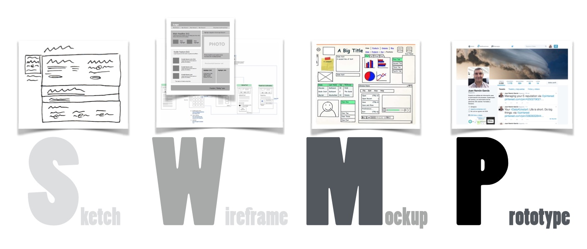

# Captura de requisitos y Prototipado

En la sesión anterior definimos un enunciado al reto inicial que sienta las bases de la solución que vamos a desarrollar en el PIA Lara.

Sobre dicho enunciado, vamos a realizar la toma de requisitos y el prototipado de la aplicación de captura de datos.

## Toma de requisitos

Sobre el enunciado que hemos consensuado, hemos de detectar qué operaciones va a realizar nuestra aplicación de captura de datos. Algunas preguntas que nos hemos de plantear son:

* ¿Necesitamos una gestión de usuarios?
* ¿Todos los usuarios tienen los mismos permisos?
* ¿Qué datos debemos introducir al dar de alta un nuevo audio?
* ¿Podemos editar los datos que hayamos etiquetado?

## Prototipado

Una vez tenemos clara las operaciones en las que nos vamos a centrar, llega la hora de prototipar nuestra aplicación. Para ello, primero nos vamos a centrar en el interfaz de usuario.

Para ello, es conveniente seguir el [proceso SWMP](https://www.eniun.com/prototipos-diseno-interfaces-web/), donde primero hacemos un boceto (*sketch*), luego un *wireframe*, a continuación un *mockup* y finalmente el prototipo.

<figure style="align: center;">
    
    <figcaption>Proceso SWMP</figcaption>
</figure>

Para la realización de los bocetos, vamos a realizar una dinámica para el diseño del interfaz de usuario de forma individual y posterior puesta en común con los compañeros del equipo.

## Plazos de entrega

* Viernes 21 Oct - 21:00h: bocetos en papel
* Martes 25 Oct - 23:59: planning
* Domingo 6 Nov - 23:59: wireframes y prototipo navegable

## Elementos evaluables

* (20%) Boceto de la navegación
    * Fotografías del borrador realizado en papel
* (20%) Wireframe
    * Capturas de pantalla
* (10%) Planning
    * Capturas de pantalla del tablero Kanban
* (50%) Prototipo: Sitio web en HTML con la navegación para poder probarlo    

<!--
Preparar salida a VK... aplicación que funcione, llevar portatiles... o aplicación en internet ... a las 17:45 allí, o a las 17:30 en s8a

Y mandaremos un mail con las tareas a realizar para el V18/11
-->