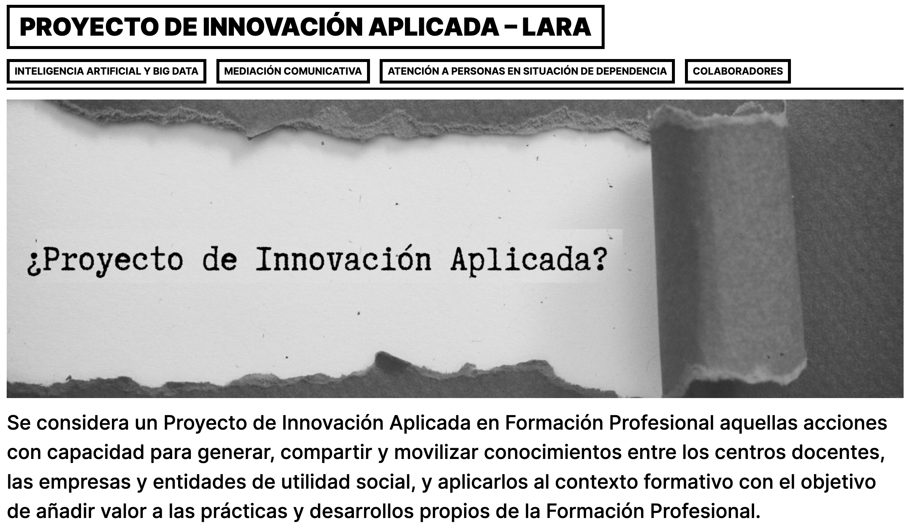

# Almacenamiento de audio

Una vez hemos revisado la aplicación de captura de datos y destacado sus funcionalidades, en esta sesión nos vamos a centrar en todo el ciclo de vida del audio, desde la grabación hasta su almacenamiento.

Un proyecto paralelo que podemos revisar antes de plantearnos cómo capturar el audio es el proyecto [Common Voice](https://commonvoice.mozilla.org/) de Mozilla, el cual quiere enseñar a las máquinas cómo hablan las personas.

Para ello, se pide que la aplicación de captura permita:

* Reproducir un audio mediante TTS a partir del texto / *sylabus* que ha preparado el perfil técnico.
* Grabación de audio desde el navegador, desde el perfil cliente, con la posibilidad de reescuchar el audio así como descartarlo antes de enviarlo al servidor.
* Almacenamiento del audio en S3,
* Limpieza del audio mediante la aplicación de filtros (opcional).

Para almacenar el audio, se recomienda seguir un planteamiento similar al de un *datalake*, donde almacenemos en S3 el audio original (raw), el mismo audio comprimido (mp3) y filtrado (sin ruido).

!!! tip "Librosa"
    [Librosa](https://librosa.org/doc/latest/index.html) es una de las librerías más empleadas para trabajar con audio desde Python. Algunas operaciones que podemos realizar es hacer un *trim* del audio, así como emplear diferentes filtros.

## Web

Ya tenemos visible publicada la web del proyecto en <https://piafplara.es/>. En el espacio de inteligencia artificial y big data vamos a publicar diversas entradas conforme vayamos desarrollando hitos en el proyecto.

<figure style="align: center;">
    
    <figcaption>Web inicial del PIA FP Lara</figcaption>
</figure>

Actualmente tenemos pendiente completar la entrada "El enfoque desde la IA" visible en <https://piafplara.es/?p=147>.

Para ello, se pide redactar de forma colaborativa un documento con el texto de la entrada. Su objetivo es contar el enfoque y lo que podemos aportar desde el curso de IABD al proyecto Lara, destacando la problemática de la dificultad comunicativa desde el punto de vista tecnológico.

## Elementos entregables

* Documento con el texto de la entrada de la web.
* Proyecto publicado en GitHub.

## Plazos de entrega

* Domingo 11 Dic - 23:59: Entrada web <https://piafplara.es>
* Miércoles 14 Dic - 15:00: Proyecto publicado en *GitHub*
* Miércoles 14 Dic (aula): Demostración de la aplicación desde el perfil de `Técnico` y de `Cliente`.

## Elementos evaluables

* 10% Docue
* 80% Aplicación de captura de datos con grabación y almacenamiento de los audios, teniendo en cuenta la documentación, legibilidad y calidad del código.
* 20% Demostración de la funcionalidad.
