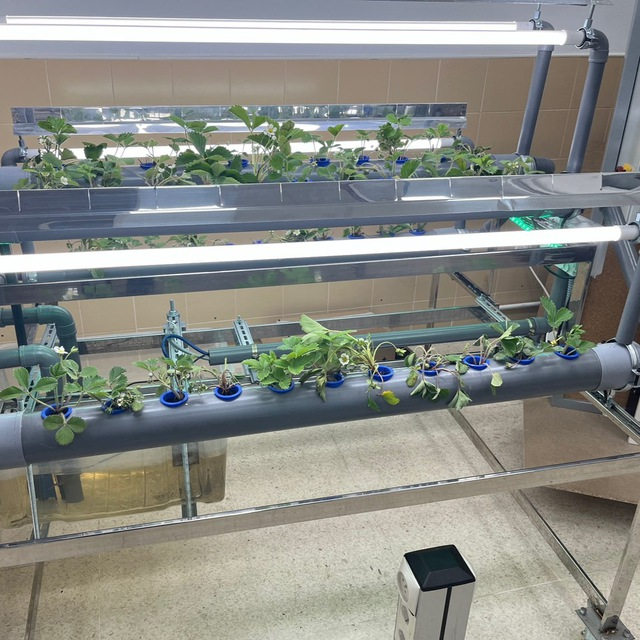
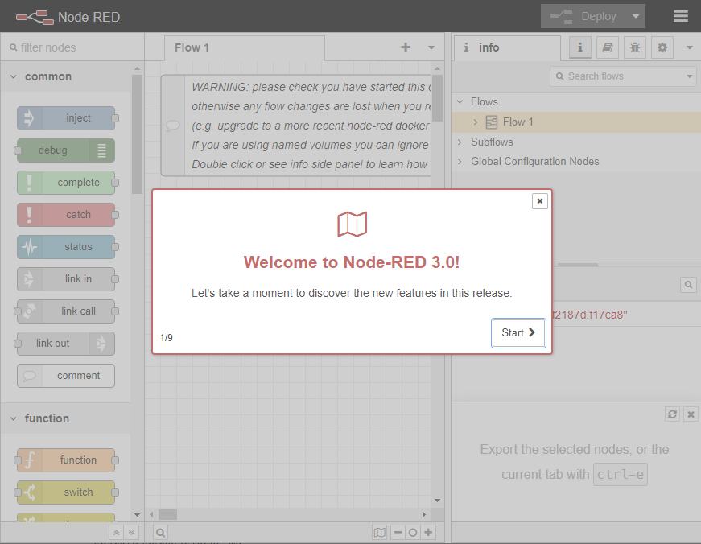

# PIA FP Autoponic

## Definición del proyecto

El proyecto de PIA FP Autoponic: Agricultura Sostenible y de
Precisión, se plantea para conseguir automatizar y digitalizar un **cultivo hidropónico autónomo y sostenible**, alimentado en su totalidad con energía renovable.

<figure style="align: center;">
    
    <figcaption>Cultivo hidropónico</figcaption>
</figure>

De este modo, se integran, dentro de la modernización del sector agrícola, diferentes tecnologías disruptivas de la Industria 4.0 como: Realidad Aumentada, Monitorización y Control a tiempo real en la Nube (Cloud Connect), IoT (Internet of Things), Big Data, Fabricación Aditiva, Virtualización y Diseño 3D, y vuelo con Drones, obteniendo sinergias con los Objetivos de Desarrollo Sostenible (ODS).

En este proyecto participan los siguientes centro y ciclos formativos:

| Centro    | Ciclo Formativo 
| ----      | ----
| IES El Palmeral (Orihuela)    | C.F.G.S. de Paisajismo y Medio Rural <br> C.F.G.S. en Sistemas Electrotécnicos y Automatizados
| IES Antonio Navarro Santafé   | C.E. en Fabricación Inteligente<br>C.F.G.S. en Sistemas Electrotécnicos y Automatizados<br>C.F.G.S. en Energías Renovables
| IES Severo Ochoa (Elche)      | C.E. Inteligencia Artificial y Big Data

Los retos del proyecto son:

* Reto 0: Iniciar al alumnado en la dinámica del trabajo colaborativo basado en retos y presentación del proyecto.
* Reto 1: Planificar el tipo de cultivo y sus parámetros a controlar.
* Reto 2: Desarrollar la infraestructura del cultivo hidropónico.
* Reto 3: Desarrollar la automatización y digitalización del proyecto, empleando dispositivos y tecnologías Omron y Siemens.
* Reto 4: Adaptar diferentes sistemas de generación de energía renovable.
* Reto 5: Completar un ciclo de cultivo hidropónico mediante el control de las diferentes variables que afectan al desarrollo del cultivo.
* Reto 6: Almacenamiento de todos los datos de sensórica para su posterior analítica y visualización mediante un cuadro de mandos.

En nuestro caso, vamos a participar de manera colateral en el reto 3, así como liderando el reto 6.

## Node-RED

Para la lectura de los sensores de IoT es muy común utilizar una herramienta low-code como [Node-RED](https://nodered.org).

Node-RED es una herramienta de programación visual desarrollada en NodeJS que se implementa en dispositivos controladores de hardware. Trabaja mostrando de manera visual las relaciones y funciones de manera que se pueda programar sin escribir código.

Funciona como un motor de flujos con enfoque IoT, que permite definir gráficamente flujos de servicios, a través de protocolos estándares como REST, MQTT, Websocket, AMQP… además de ofrecer integración con APIs de terceros, tales como Twitter, MongoDB, S3, etc...

Para arrancar Node-RED mediante *Docker*, empleamos el comando:

``` bash
docker run -it -p 1880:1880 -v node_red_data:/data --name iabd-nodered nodered/node-red
```

Una vez, arrancado, si accedemos a <http://localhost:1880> se nos abrirá la pantalla de bienvenida:

<figure style="align: center;">
    
    <figcaption>Inicio de Node-RED</figcaption>
</figure>

### Hola Node-RED

A continuación vamos a ver un par de ejemplos sobre como funciona Node-RED, para los cuales nos vamos a basar en los siguientes artículos de la documentación de Node-RED:

* [Creating your first flow](https://nodered.org/docs/tutorials/first-flow)
* [Creating your second flow](https://nodered.org/docs/tutorials/second-flow)

Una vez hemos visto un par de ejemplos básicos, comentar un par de aspectos:

* Cada nodo sólo puede tener una entrada y múltiples salidas.
* Si un nodo tiene cambios sin desplegar, se muestra un circulo azul sobre él. Si hay errores en la configuración, se muestra un triángulo rojo.
* Los mensaje que viajan de un nodo a otros son mensajes JSON.

!!! info "Más información"
    Si quieres saber más sobre Node-RED y cómo lo utilizan nuestros compañeros del IES Navarro Santafé, puedes ver la siguiente [playlist con vídeo-tutoriales de José Férriz](https://www.youtube.com/channel/UCiZD7vYbdGQAo38D1DcCVVg/videos).

## Elementos entregables

* Flujo con generación aleatoria de temperaturas y luminosidad cada 30 segundos, mediante dos flujos separados que se unen para crear un único mensaje.
* Flujos que realicen operaciones de lectura y escritura de datos en *MongoAtlas* haciendo uso del nodo <https://flows.nodered.org/node/node-red-contrib-mongodb4>.

## Plazos de entrega

* Jueves 26 Ene - 23:59: Flujos exportados desde Node-RED.
