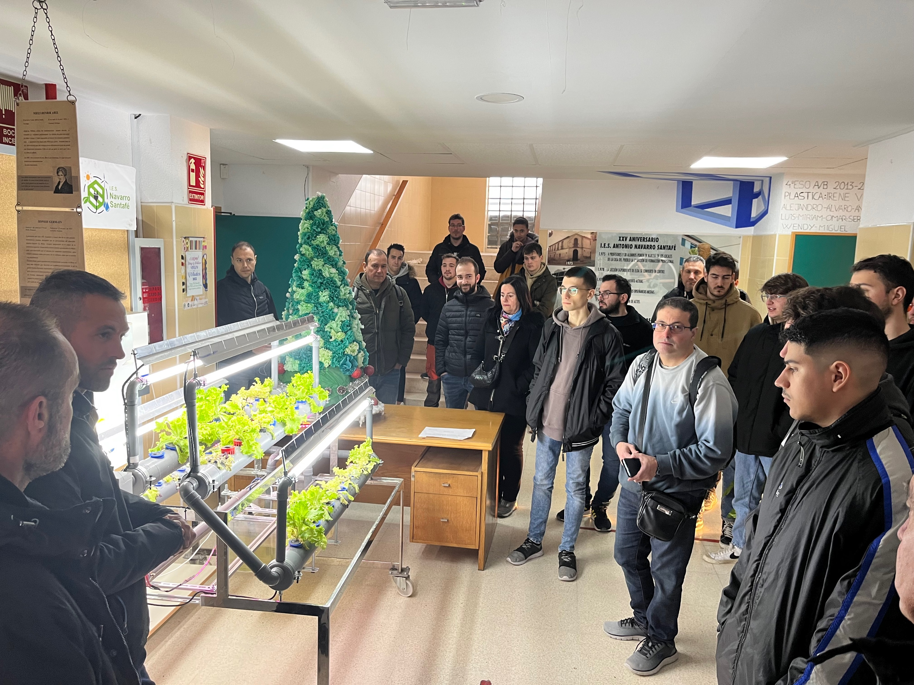
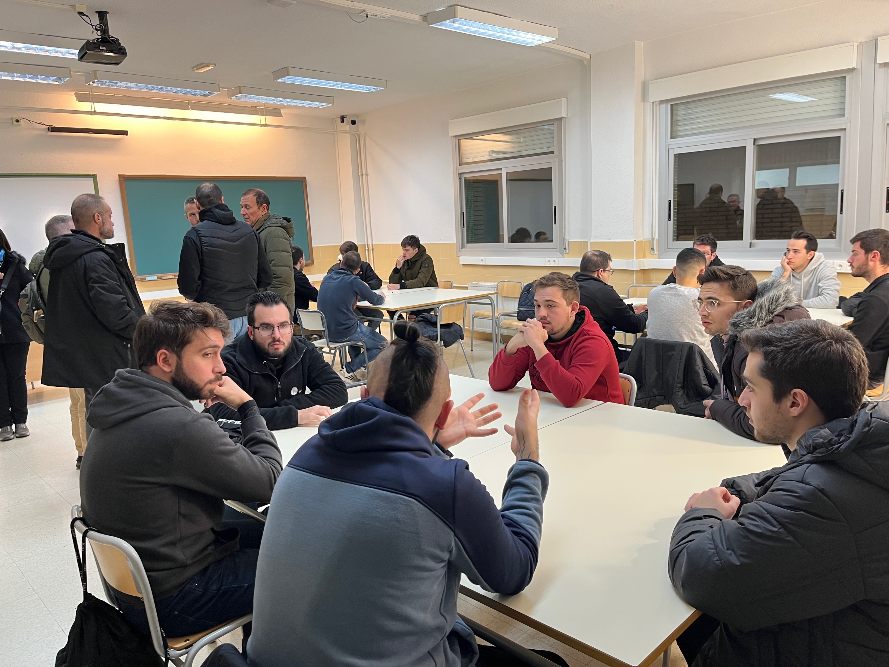
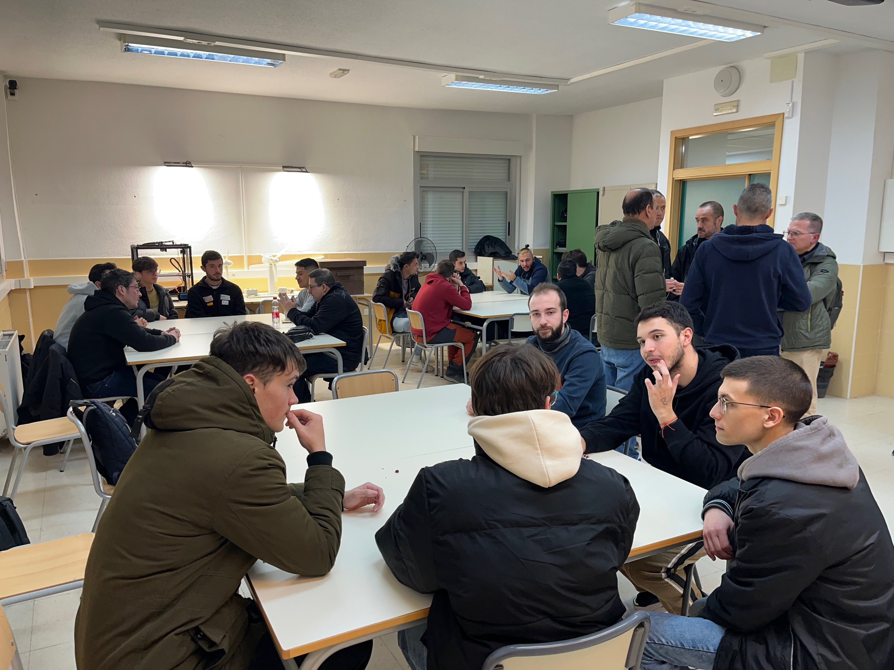

# Visita IES Navarro Santafé

Para conocer el funcionamiento del cultivo hidropónico y cómo se realiza la comunicación desde un sensor hasta que se guarda su datos, hemos realizado una visita al *IES Navarro Santafé* en Villena donde el alumnado del C.E. en *Fabricación Inteligente*, el C.F.G.S. en *Sistemas Electrotécnicos y Automatizados* y C.F.G.S. en *Energías Renovables* nos han contado el proyecto.

## Toma de contacto

Al llegar al centro, recibimos una formación sobre el uso de sensores y PLC empleados para la sensórica de un cultivo hidropónico que ya han realizado en el centro, sobre el cual vamos a iterar introduciendo nuevos sensores.

<figure style="align: center;">
    
    <figcaption>Conociendo el cultivo hidropónico</figcaption>
</figure>

## Puesta en común

Tras el descanso, realizamos una dinámica donde el alumnado de los diferentes ciclos estuvo compartiendo su conocimiento, sugerencias sobre qué sensores, cómo y cuándo enviar la información, y la forma de compartir la información.

<figure style="align: center;">
    
    <figcaption>Dinámica de trabajo</figcaption>
</figure>

El punto de unión de ambos centros se realizará mediante el software NodeRED.

<figure style="align: center;">
    
    <figcaption>Aplicando metodologías activas</figcaption>
</figure>

La actividad fue muy bien recibida por todo el alumnado, trabajando competencias transversales y favoreciendo el trabajo entre equipos multidisciplinares.

## Siguientes pasos

* Definir un modelo de datos en *MongoDB* para almacenar la información de los sensores (temperatura interior, temperatura exterior, ...). El alumnado del *IES Navarro Santafé* ya ha definido un conjunto inicial de sensores sobre los cuales trabajar. Queda pendiente elegir los sensores iniciales, así como conocer el dominio de sus valores.
* Consensuar los sensores que también utilizar el *IES El Palmeral*.
* Crear un flujo en NodeRED que almacene los datos en *Mongo Atlas*. Para ello, deberemos estudiar cómo podemos almacenar series temporales en MongoDB.
