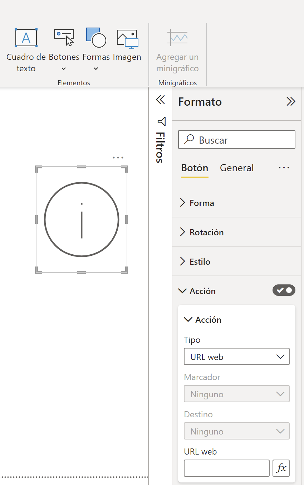

# Actuadores

En esta sesión nos vamos a centrar en crear una prueba de concepto para simular la invocación desde el cuadro de mandos a un servicio REST que haga de actuador con NodeRED.

<figure style="float: right;">
    
    <figcaption>Botón en PowerBI</figcaption>
</figure>

## Botón en PowerBI

Para ello, en *PowerBI* vamos a crear un botón que al pulsarlo, mediante la configuración de la acción a tipo *URL web*, le indiquemos la URL de nuestro servicio REST.

## Servicio REST

Para el servicio REST podríamos crear un aplicación *Flask*, pero como no tenemos un servidor web en *Autoponic*, vamos a utilizar las funciones *AWS Lambda* que permiten el acceso desde el exterior como una URL, de manera que al invocarla, por ejemplo, realicemos una inserción en *MongoDB*.

Para facilitar el trabajo, en Aules tenemos un archivo comprimido que ya incluye la librería de *PyMongo* dentro de una función que no termina de funcionar.

## Elementos evaluables

* Cuadro de mandos con botón que invoca a un servicio REST
* Código de la función lambda que realiza la inserción

## Plazo de entrega

* Miércoles 5 Abril - 23:59: Archivo `pbix` de *PowerBi* con el cuadro de mandos y zip con la función Lambda